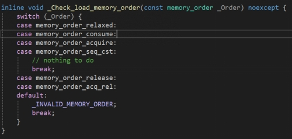
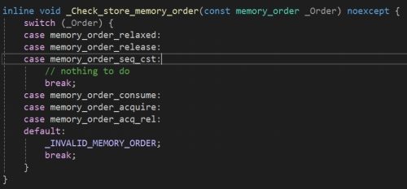

### 一、互斥锁

#### 1.1 什么是互斥锁

- 互斥锁是一种保护共享资源不被多个线程同时访问的同步机制。确保在同一时刻只有一个线程可以访问共享资源，避免数据竞争和不一致的问题。


#### 1.2 互斥锁的作用

- 保护共享数据。多线程的运行是不可预测的，多个线程可能会同时访问和修改共享资源，如果没有互斥锁保护可能导致共享资源不是我们期望的状态。比如一个计数器程序，多个线程同时对计数器进行加一操作，如果没有互斥锁，可能导致计数器的值不正确。

#### 1.3 使用互斥锁的代码示例

```C++
#include <iostream>
#include <thread>
#include <vector>
#include <mutex>

std::mutex mtx; //全局互斥锁
int shared_resource = 0;	//共享资源

void increment()
{
    for (int i = 0; i < 10000; ++i)
    {
        std::lock_guard<std::mutex> lock(mtx);
        ++shared_resource;	 // 修改共享资源
    }
}

int main()
{
    const int num_threads = 10;
    std::vector<std::thread> threads;

    for (int i = 0; i < num_threads; ++i)
    {
        threads.emplace_back(increment);
    }
    for (auto& thread : threads)
    {
        thread.join();
    }
    std::cout << "final shared_resource: " << shared_resource << std::endl;
    return 0;
}
```

```c++
//运行结果，加了互斥锁的效果
//10个线程，每个线程都对共享资源加10000次，预期结果是100000
Final value of shared_resource: 100000

//某次运行结果，每次运行结果都不相同，这是没有加互斥锁的效果，也就是注释掉std::lock_guard<std::mutex> lock(mtx);
Final value of shared_resource: 94411
```

通过上述结果比对，我们可以看出互斥锁的加锁效果和必要性。如果不加互斥锁会导致竞争和数据不一致的问题，导致最终的数据不是我们所期望的。

### 二、读写锁

#### 2.1 什么是读写锁

- 在 C++ 中，读写锁（Read-Write Lock，也称为共享-互斥锁）是一种同步机制，用于允许多个线程同时读取共享资源，但写操作需要独占访问。这种锁特别适用于读操作频繁而写操作较少的场景，可以显著提高并发性能。

##### 2.1.1 读锁的特性

- 多个线程可以同时获取读锁。
- 读锁允许多个线程同时读取共享资源。
- 读锁的获取不会阻塞其他线程的读操作。

##### 2.1.2 写锁的特性

- 一次只能有一个线程获取写锁。
- 写锁的获取会阻塞其他线程的读操作和写操作，也就是一次只能有一个线程获取写锁。

#### 2.2 使用读写锁的原因

##### 2.2.1 提高并发性能

- 在许多实际应用中，对共享资源的访问模式通常是读操作频繁而写操作较少。比如说数据库查询操作远多于更新操作。缓存系统中，读取缓存数据的操作远多于写入缓存数据的操作。
- 在上述几种情况下，如果使用传统的互斥锁`std::mutex`，无论是读操作还是写操作，每次只有一个线程可以访问共享资源。这会导致大量的线程阻塞，降低系统的并发性能。

##### 2.2.2 优化资源利用率

- 在读多写少的场景中，读写锁可以更有效地利用系统资源。通过允许多个线程同时读取共享资源，系统可以更好地利用多核处理器的并行能力，提高整体性能。

##### 2.2.3 减少锁竞争

- 使用传统的互斥锁时，所有线程（无论是读操作还是写操作）都需要竞争同一个锁。这会导致大量的线程阻塞，尤其是在高并发的情况下。读写锁通过将锁分为读锁和写锁，减少了线程对锁的竞争，提高了系统的响应速度和吞吐量。

#### 2.3 适用场景

##### 2.3.1 数据库查询和更新

- 假设我们有一个多线程的数据库应用程序，其中大部分线程执行查询操作，只有少数线程执行更新操作。使用读写锁可以显著提高查询操作的性能，同时确保更新操作的原子性和一致性。像`MySQL`数据库它本身就提供了共享锁`S锁`和独占锁`X锁`。

##### 2.3.2 缓存系统

- 在缓存系统中，读取缓存数据的操作远多于写入缓存数据的操作。使用读写锁可以允许多个线程同时读取缓存数据，而写操作可以独占访问缓存，确保数据的一致性。

##### 2.3.3 日志系统

- 在日志系统中，读取日志的操作远多于写入日志的操作。使用读写锁可以允许多个线程同时读取日志，而写操作可以独占访问日志文件，确保日志的完整性和一致性。


#### 2.4 读写锁的使用示例

```c++
#include <iostream>
#include <thread>
#include <vector>
#include <shared_mutex>
#include <chrono>

class SharedResource
{
public:
    void read(int id)
    {
        std::shared_lock<std::shared_mutex> lock(m_mutex);
        std::this_thread::sleep_for(std::chrono::milliseconds(100)); // 模拟读操作   
        printf("Reader id is reading Value is: %d\n", id);
    }

    void write(int id)
    {
        std::unique_lock<std::shared_mutex> lock(m_mutex);
        std::this_thread::sleep_for(std::chrono::milliseconds(100)); // 模拟写操作
        m_value = id;
        printf("Writer id is writing Value is: %d\n", id);
    }

private:
    std::shared_mutex m_mutex;
    int m_value = 0;
};

void reader_function(SharedResource& resource, int id) 
{
    resource.read(id);
}

void writer_function(SharedResource& resource, int id)
{
    resource.write(id);
}

int main()
{
    SharedResource resource;
    std::vector<std::thread> threads;

    // 创建多个读线程
    for (int i = 0; i < 5; ++i)
    {
        threads.emplace_back(reader_function, std::ref(resource), i);
    }

    // 创建多个写线程
    for (int i = 0; i < 2; ++i)
    {
        threads.emplace_back(writer_function, std::ref(resource), i + 10);
    }

    for (auto& thread : threads)
    {
        thread.join();
    }

    return 0;
}
```
### 三、自旋锁

#### 3.1 什么是自旋锁

- 自旋锁（Spinlock）是一种同步原语，用于在多线程环境中保护共享资源的访问。与传统的互斥锁 `std::mutex`不同，自旋锁不会使线程进入阻塞状态，而是在尝试获取锁时不断循环（“自旋”），直到锁变为可用。

#### 3.2 自旋锁的工作原理

- 当一个线程尝试获取锁时，如果锁已经被其他线程占用，它不会将线程置于阻塞状态，而是不断循环检查锁的状态。
- 一旦自旋锁被释放从而变的可用，线程立即获取锁并继续执行。

#### 3.3 自旋锁的优点

##### 3.3.1 低延迟

- 自旋锁可以非常快速地获取和释放，适合于锁的持有时间非常短的场景。

##### 3.3.2 避免上下文切换

- 由于线程不会被挂起，因此不会触发上下文切换，减少了上下文切换的开销。如果我们使用互斥锁，线程由于获取不到锁而被阻塞，由运行态转变为阻塞态，这会发生CPU的上下文切换，是因为发生了系统调用。

#### 3.4 自旋锁的缺点

##### 3.4.1 CPU资源浪费

- 在锁持有时间比较长的场景中，锁被占用的时间较长，自旋锁会导致线程不断占用 CPU 资源，浪费CPU时间。

##### 3.4.2 可能导致饥饿

- 如果多个线程同时竞争，可能会导致某些线程长时间无法获取锁，从而出现饥饿现象。
- CPU 时间片竞争，自旋线程持续占用 CPU，导致其他等待锁的线程几乎没有机会运行。
- 优先级反转，如果一个低优先级线程持有锁，而高优先级线程在自旋，那么高优先级线程可能会一直忙等，反而影响系统调度，使中等优先级的线程（甚至持锁的线程）得不到 CPU。
- 自旋锁通常不保证先来先得。如果多个线程同时在自旋，谁能抢到锁完全取决于调度和竞争时机，某些线程可能一直“运气不好”而饥饿。

#### 3.3 代码实现伪自旋锁

```c++
#include <atomic>
#include <thread>
#include <iostream>

class Spinlock
{
public:
    void lock()
    {
        bool expected = false;
        while (!m_flag.compare_exchange_strong(expected, true, std::memory_order_acquire))
        {
            expected = false; // 重置预期值
        }
    }

    void unlock()
    {
        m_flag.store(false, std::memory_order_release);
    }

private:
    std::atomic<bool> m_flag{false};
};

void critical_section(Spinlock& lock, int id)
{
    lock.lock();
    std::cout << "Thread " << id << " is in the critical section." << std::endl;
    std::this_thread::sleep_for(std::chrono::milliseconds(100)); // 模拟临界区操作
    lock.unlock();
}

int main()
{
    Spinlock lock;
    std::vector<std::thread> threads;

    for (int i = 0; i < 10; ++i)
    {
        threads.emplace_back(critical_section, std::ref(lock), i);
    }

    for (auto& thread : threads)
    {
        thread.join();
    }

    return 0;
}
```

### 四、条件变量

#### 4.1 什么是条件变量

- C++ 中的条件变量如`std::condition_variable` 或 `std::condition_variable_any`是一种线程同步机制，用于阻塞一个或多个线程，直到某个条件满足，通常和 `std::mutex` 搭配使用。它能避免忙等（自旋锁常见的问题），提高 CPU 利用率。

#### 4.2 条件变量的核心概念

##### 4.2.1 用于线程间的通信

- 一个线程等待某个条件（例如“队列不为空”），另一个线程满足条件后通知它。具体可以是这样的，我们有一个队列，其中存放整形数据。N 个线程从队列中读取数据，N 个线程写入数据到队列中。如果队列为空，那么读取数据的线程就被阻塞掉，直到写入数据的线程再次写入数据，队列中有数据，就通知被阻塞的读取数据的线程，使其被唤醒。

##### 4.2.2 避免轮询

- **条件变量**不像**自旋锁**那样一直检查条件，条件变量通过**挂起线程**直到条件满足才唤醒。

##### 4.2.3 基于等待队列

- 当线程调用 `wait()`方法 时，会自动释放互斥锁并进入等待队列。直到被唤醒，再次通过条件判断是否可以获取锁。

#### 4.3 条件变量的使用场景

##### 4.3.1 生产者-消费者模型

- 生产者线程，向共享缓冲区（比如队列）写入数据。
- 消费者线程，从共享缓冲区获取数据进行处理。
- **条件变量作用**
  - 当队列为空时，消费者不忙等，而是 `wait()` 等待条件（`!queue.empty()`）。
  - 当队列满时，生产者可以 `wait()`，直到有队列不满。
  - 生产者线程和消费者线程都可以用 `notify_one()` 或 `notify_all()` 唤醒对方。

##### 4.3.2 线程池工作线程同步

- 主线程提交任务，放入任务队列。
- 多个工作线程（消费者）竞争从队列取任务。
- 如果队列为空，工作线程需要休眠，直到有任务。

- **条件变量作用**
	- 工作线程 `wait()` 等待任务到来。
	- 当主线程提交新任务，`notify_one()` 或 `notify_all()` 唤醒空闲线程。
	- 保证线程池在没有任务处理的时候不会疯狂自旋。

#### 4.4 条件变量在生产者消费者模型中的使用

```c++
#include <iostream>
#include <thread>
#include <mutex>
#include <condition_variable>
#include <queue>
#include <vector>
#include <chrono>

std::mutex mtx;
std::condition_variable cv;
std::queue<int> buffer;
const size_t MAX_BUFFER_SIZE = 10;
bool done = false; // 生产结束标志

void producer(int id, int count)
{
    for(int i = 0; i < count; ++i)
    {
        std::unique_lock<std::mutex> lock(mtx);
        cv.wait(lock, []()
        { 
            return buffer.size() < MAX_BUFFER_SIZE; 
        }); // 队列满则等待

        buffer.push(i);
        std::cout << "Producer " << id << " produced " << i << "\n";
        lock.unlock();
        cv.notify_all(); // 通知消费者
        std::this_thread::sleep_for(std::chrono::milliseconds(50)); // 模拟生产耗时
    }
}

void consumer(int id)
{
    while(true)
    {
        std::unique_lock<std::mutex> lock(mtx);
        cv.wait(lock, [] 
        { 
            return !buffer.empty() || done; 
        }); // 队列为空且未结束则等待

        if(buffer.empty() && done)
        {
            break; // 没有数据且生产结束，退出
        }

        int item = buffer.front();
        buffer.pop();
        std::cout << "Consumer " << id << " consumed " << item << "\n";
        lock.unlock();
        cv.notify_all(); // 通知生产者
        std::this_thread::sleep_for(std::chrono::milliseconds(100)); // 模拟消费耗时
    }
}

int main()
{
    const int producerCount = 3;
    const int consumerCount = 4;
    const int itemsPerProducer = 10;

    std::vector<std::thread> producers;
    std::vector<std::thread> consumers;

    // 启动消费者
    for(int i = 0; i < consumerCount; ++i)
    {
        consumers.emplace_back(consumer, i);
    }

    // 启动生产者
    for(int i = 0; i < producerCount; ++i)
    {
        producers.emplace_back(producer, i, itemsPerProducer);
    }

    // 等待所有生产者完成
    for(auto& p : producers)
    {
        p.join();
    }

    // 通知消费者生产结束
    {
        std::lock_guard<std::mutex> lock(mtx);
        done = true;
    }
    cv.notify_all();

    for(auto& c : consumers)
    {
        c.join();
    }

    return 0;
}
```

### 五、原子操作

#### 5.1 原子操作的特点

- 原子操作是一种不可分割的操作，他在执行过程中不会被中断或被其他操作所干扰，通常用于并发编程中，确保多线程环境下操作的正确性，避免数据竞争和不一致的状态。
- 原子操作要么完全执行，要么完全不执行。他不允许其他线程在操作中介入，所有的操作都是一个完整的单元。
- 使用原子操作可以保证数据的一致性，每个线程都会看到数据的最新值，因为其操作是不可分割的，在修改一个变量的过程中是不会被打断的。

#### 5.2 C++中常见的原子操作

- ```c++
  std::atomic<int> x{42};	//定义一个原子变量x
  int value = x.load(std::memory_order_acquire);  // 原子读，value == 42
  x.store(42, std::memory_order_release);       // 原子写，设置release内存序
  int old1 = x.fetch_add(3);      // x += 3;
  int old2 = x.fetch_sub(1);      // x--
  ```

### 六、内存序

#### 6.1 C++11中的内存序枚举值

##### 6.1.1 memory_order_relaxed  

- releaxed 内存序，仅保证原子操作，不对编译器和 CPU 进行限制，也就是还可能会发生指令重排的问题。
- 影响就是 CPU 或者编译器可能重排这个操作和其他指令的顺序。

##### 6.1.2 memory_order_release 

- 设定内存屏障（Memory barrier），保证它之前的操作永远在它之前，但是它后面的操作可能被重排到它前面。

##### 6.1.3 memory_order_acquire 

- 设定内存屏障，保证在它之后的访问永远在它之后，但是它之前的操作却有可能被重排到它后面，往往和 release 在不同线程中联合使用。

##### 6.1.4 memory_order_consume  

- 改进版的`memory_order_acquire` ，开销更小。

##### 6.1.5 memory_order_acq_rel  

- 它是`acquire`和`release`的结合，同时拥有它们俩提供的保证。比如你要对一个`atomic`自增1，同时希望该操作之前和之后的读取或写入操作不会被重新排序。


##### 6.1.6 memory_order_seq_cst   

- `memory_order_seq_cst`就像是`memory_order_acq_rel`的加强版，它不管原子操作是属于读取还是写入的操作，只要某个线程有用到`memory_order_seq_cst`的原子操作，线程中该`memory_order_seq_cst`操作前的数据操作绝对不会被重新排在该`memory_order_seq_cst`操作之后，且该`memory_order_seq_cst`操作后的数据操作也绝对不会被重新排在`memory_order_seq_cst`操作前。

#### 6.2 内存序的作用

- 我们的程序最终会编译成二进制指令，也就是机器码，最终由 CPU 执行。指令排序指的是编译器和 CPU 在执行这些二进制指令时如何选择执行的顺序。
- 内存序这个东西还是限制的当前指令限制其他指令的执行顺序，确保其他指令在当前指令执行之前还是之后。
-  `atomic`的`store`和`load`也有相关的内存序的限制，会进行一个检查。非法的内存序会抛出一个异常。`load`和`store`分别是读和写操作，他们的内存序也限制了其他线程能否及时看到更新后的数据。
- 对于`load`操作，进行内存序检查，如图所示。

 

- 对于`store`操作，也会进行内存序检查，如图所示。

 

#### 6.3 内存序基本示例

```c++
#include <atomic>
#include <thread>
#include <iostream>
#include <vector>

std::atomic<int> data(0);            // 共享数据
std::atomic<bool> ready(false);      // 标志位，表示数据是否准备好

/*
生产者线程就做两件事，第一个是写入data，第二个是写入ready
写入ready，ready为true，就会通知消费者线程
*/
void producer()
{
    
    data.store(42, std::memory_order_relaxed);   // 写数据（可以放松，因为后面release保证可见性）
    //这里的release内存序就限制了data的写入不可能被重排到ready写入true之后
    ready.store(true, std::memory_order_release); // 发布数据，保证data对消费者可见
    std::cout << "Producer: data = 42\n";
}

/*消费者做两件事：
ready.load(memory_order_acquire)反复检查，直到 ready 为 true。
data.load(memory_order_relaxed)
*/
void consumer()
{
    //这里的acquire就限制了后续的data的读取不可能被重排到read读取为true之前，保证data读取到生产者写入的值
    while(!ready.load(std::memory_order_acquire))
    { 
        
    }
    int value = data.load(std::memory_order_relaxed); // 数据读取，此时保证看到producer写入的值
    std::cout << "Consumer: data = " << value << "\n";
}

int main()
{
    std::thread t1(producer);
    std::thread t2(consumer);

    t1.join();
    t2.join();
    return 0;
}
```

### 七、乐观锁

#### 7.1 什么是乐观锁

- 乐观锁是一种并发控制机制，它假设并发操作不会发生冲突，因此在操作之前不加锁。在操作完成时，再检查是否有冲突，如果有冲突则进行相应的处理（如重试、抛出异常等）。与悲观锁不同，乐观锁在大多数情况下无需加锁，从而减少了锁竞争，提高了系统性能。

#### 7.2 乐观锁的特点

- 假设竞争不会发生，一开始不会加锁，加锁的粒度小，允许多线程或多进程并发的访问共享资源。只有在修改资源时，才会检查其他线程是否修改了资源，检测的方式包括版本号或者是时间戳。如果其他线程没有修改资源，那么就提交，否则就回滚。

##### 7.2.1 不加锁（无阻塞）

- 在读取数据时不对资源加物理锁，允许多个线程同时访问，提高系统并发性能。

##### 7.2.2 冲突检测

- 在更新数据时，通过**版本号（version）**或**时间戳**判断数据是否被修改，如果修改过，则更新失败。

##### 7.2.3 不会产生死锁

-  因为没有物理锁，所以不会出现死锁问题。

#### 7.3 乐观锁的使用场景

- 适用于冲突不频繁的场景，能够提升并发性能。
- 适用于写操作少，但读操作多的场景。

#### 7.4 乐观锁的实现示例

##### 7.4.1 C++中的乐观锁

```c++
/*通过版本号和时间戳的方式差不多，都是在读取时，记录当前的版本号或者是时间戳，提交修改时判断版本号或者时间戳是否被修改，如果没有被修改则提交。否则报错或者是继续重试。*/
#include <atomic>
#include <thread>
#include <iostream>
#include <vector>

struct Product
{
    std::atomic<int> stock{ 100 };
    std::atomic<int> version{ 0 };
};

bool updateStock(Product& p)
{
    int oldStock = p.stock.load();
    int oldVersion = p.version.load();

    if (oldStock <= 0)
    {
        return false;
    }

    // 模拟乐观锁：检查版本号再修改
    if (p.version.compare_exchange_strong(oldVersion, oldVersion + 1))
    {
        // 修改库存
        p.stock.store(oldStock - 1);
        return true;
    }
    return false; // 版本号不匹配，说明有其他线程更新过
}

int main()
{
    Product p;
    std::vector<std::thread> threads;

    for (int i = 0; i < 10; i++)
    {
        threads.emplace_back([&]()
        {
            if (updateStock(p))
            {
                std::cout << "Stock updated successfully\n";
            }
            else
            {
                std::cout << "Update failed (conflict)\n";
            }
        });
    }

    for (auto& t : threads)
    {
        t.join();
    }
    std::cout << "Final stock: " << p.stock << ", version: " << p.version << "\n";
}
```

##### 7.4.2 数据库中的乐观锁

```sql
-- 创建产品表
CREATE TABLE product (
    id BIGINT PRIMARY KEY AUTO_INCREMENT,-- 主键
    name VARCHAR(100) NOT NULL, -- 商品名称
    stock INT NOT NULL, -- 库存数量
    version INT NOT NULL DEFAULT 0,  -- 乐观锁版本号
    price DECIMAL(10, 2) NOT NULL -- 商品价格
);
-- 插入一条商品数据
INSERT INTO product (name, stock, version, price)
VALUES ('iPhone 16 Pro', 100, 0, 8999.00);

-- 读取商品信息
SELECT id, name, stock, version, price
FROM product WHERE id = 1;

-- 扣减库存，这里首先判断version是否变化，如果变化则表示数据库记录被其他事务修改，这里就不能更新，需要重新读取并重试
UPDATE product
SET stock = stock - 1, version = version + 1
WHERE id = 1 AND version = 0;
```

### 八、悲观锁

#### 8.1 什么是悲观锁

- 悲观锁（Pessimistic Lock）是一种**并发控制策略**，它假设数据在访问时很容易被其他事务修改，因此采取“悲观”的态度—**在操作前先加锁**，确保在锁释放之前，其他事务不能修改这份数据。

#### 8.2 悲观锁的特点

##### 8.2.1 访问即加锁

- 在读取或更新数据之前，先获取锁（共享锁或排他锁），避免并发修改。
- 不像乐观锁一样，只有在修改的时候才判断是否冲突。

##### 8.2.2 阻塞机制

- 如果一个事务持有锁，其他事务只能等待或超时。
- 对于像 C++ 中的多线程环境而言，就是一个线程持有互斥锁，其他线程由于获取不到互斥锁而阻塞。

##### 8.2.3 可能导致死锁

- 如果多个事务互相等待锁，可能发生死锁，需要数据库或程序层面检测。这一点的话，如果事务长时间获取不到锁，会报出一个获取锁超时的错误。
- 对于 C++ 多线程环境，就是持有锁的线程长时间不释放锁，造成多个线程由于获取不到锁而阻塞，最终造成死锁。

##### 8.2.4 强一致性

- 因为加锁后，其他事务无法修改数据，所以能保证操作期间数据的一致性。

#### 8.3 悲观锁的使用场景

##### 8.3.1 写操作频繁，冲突概率高

- 如果资源竞争严重，比如**库存扣减**且每次扣减量大，乐观锁重试代价太高，这时用悲观锁。乐观锁就一直进行判断，持续的消耗 CPU 资源，也获取不到锁。

##### 8.3.2 强一致性要求高的场景

- 例如**金融转账**、订单扣款，不能允许并发修改导致资金不一致。

##### 8.3.4 长事务且修改逻辑复杂

- 如果事务执行时间长，用乐观锁容易失败重试多次，性能更差。
- 悲观锁的话，就直接阻塞事务或者线程，不会导致一直重试。

#### 8.4 悲观锁的使用示例

##### 8.4.1 C++中的悲观锁

```c++
#include <iostream>
#include <thread>
#include <mutex>
#include <vector>

struct Product {
    int stock = 100;
    std::mutex mtx;  
};

void updateStock(Product& p)
{
    std::lock_guard<std::mutex> lock(p.mtx); 
    if (p.stock > 0)
    {
        p.stock--;
        std::cout << "Stock updated: " << p.stock << "\n";
    }
    else
    {
        std::cout << "No stock left\n";
    }
}

int main()
{
    Product p;
    std::vector<std::thread> threads;
    for (int i = 0; i < 10; ++i)
    {
        threads.emplace_back(updateStock, std::ref(p));
    }
    for (auto& t : threads)
    {
        t.join();
    }
    std::cout << "Final stock: " << p.stock << "\n";
}
```

##### 8.4.2 数据库中的悲观锁

```sql
START TRANSACTION;

-- FOR UPDATE 会加排他锁，保证当前事务修改时，其他事务不能修改这行记录。
SELECT stock FROM product WHERE id = 100 FOR UPDATE;
UPDATE product SET stock = stock - 1 WHERE id = 100;

COMMIT;
```

### 九、锁分段

#### 9.1 锁分段的概念

- 锁分段（Lock Striping）是一种并发控制优化技术，它的核心思想是：**将一个大锁拆分成多个小锁，减少锁竞争，提升并发性能**。

#### 9.2 锁分段的特点

##### 9.2.1 加锁粒度更细，减少锁竞争

- 多个线程操作不同分段时，可以同时加锁，提升并发度。
- 如果多个线程操作的是不同段的数据，可以并行执行，避免所有线程都在等待一把大锁。

##### 9.2.2 增加内存开销 & 复杂度

- 每个段需要维护一把锁，代码复杂度上升，同时可能需要计算 hash 选择锁。

##### 9.2.3 一致性控制要注意

- 如果操作涉及多个分段，可能需要同时持有多个锁，设计不当会导致死锁。

#### 9.3 锁分段的代码示例

```c++
#include <iostream>
#include <vector>
#include <mutex>
#include <unordered_map>
#include <thread>
#include <array>

class StripedMap
{
    static constexpr std::size_t kShards = 8;         // 段数
    struct Shard    
    {
        std::mutex mtx;
        std::unordered_map<int, int> data;
    };
	//数组存储多个段，每个段有自己的锁和数据
    std::array<Shard, kShards> shards_;

    // 根据 key 计算落到哪个段
    Shard& shardFor(size_t key)
    {
		std::cout << "key % KShards: " << key % kShards << '\n';
        return shards_[key % kShards];
    }

public:
    void insert(int key, int val)
    {
        Shard& s = shardFor(key);
        std::lock_guard<std::mutex> lg(s.mtx);    // 只锁住本段
		std::cout << "key: " << key << ", value: " << val << '\n';
        s.data[key] = val;
    }

    int size()
    {
        int total = 0;
        for (auto& s : shards_) 
        {
            std::lock_guard<std::mutex> lg(s.mtx);    // 只锁住本段
            total += s.data.size();
        }
        return total;
    }
};

int main()
{
    StripedMap map;

	constexpr int kThreads = 16;    // 线程数量
	constexpr int kPerThread = 1000;    //每个线程插入的元素数量

    auto worker = [&](int offset)
    {
        for (int i = 0; i < kPerThread; ++i)
        {
            map.insert(offset + i, i);
        }
    };

    std::vector<std::thread> pool;
    for (int t = 0; t < kThreads; ++t)
    { 
        pool.emplace_back(worker, t * kPerThread);
    }

    for (auto& th : pool)
    {
        th.join();
    }

    std::cout << "Total entries: " << map.size() << '\n';
    return 0;
}
```

### 十、固定加锁顺序

#### 10.1 什么是加锁顺序

- 当一个线程需要获取多个锁时，**必须按照固定的顺序获取锁**，所有线程遵循相同的顺序，这样可以**避免循环等待**，从而防止死锁。

#### 10.2 为什么要注意加锁顺序

- 死锁的四个必要条件之一是**循环等待**
- 如果不同线程在获取多个锁时顺序不一致，就可能出现循环等待：

  - 线程 A 拿锁 `L1` 等 `L2`
  - 线程 B 拿锁 `L2` 等 `L1`

  固定加锁顺序可以彻底打破这个条件，避免死锁。

#### 10.3 不当的加锁顺序带来的死锁问题

```c++
#include <iostream>
#include <thread>
#include <mutex>
#include <chrono>

std::mutex m1, m2;

void threadA()
{
    m1.lock();  // 线程A先锁m1
    std::this_thread::sleep_for(std::chrono::milliseconds(100)); // 模拟操作
    m2.lock();  // 再锁m2
    std::cout << "Thread A done\n";
    m2.unlock();
    m1.unlock();
}

void threadB()
{
    m2.lock();  // 线程B先锁m2
    std::this_thread::sleep_for(std::chrono::milliseconds(100)); // 模拟操作
    m1.lock();  // 再锁m1
    std::cout << "Thread B done\n";
    m1.unlock();
    m2.unlock();
}

int main()
{
    std::thread t1(threadA);
    std::thread t2(threadB);
    t1.join();
    t2.join();
}

// 上述程序，由于线程A获取互斥锁m1并成功加锁，休眠一段时间后，再次尝试获取互斥锁m2。在线程A休眠的时间内，线程B可能抢到CPU时间片，尝试获取互斥锁m2并成功加锁，休眠一段时间后尝试获取互斥锁m1。由于线程A持有互斥锁m1，并且请求互斥锁m2，线程B持有互斥锁m2，并且请求互斥锁m1。这就造成了一个循环等待问题，双方都在请求对方持有的资源，并且不释放自身持有的资源。最终导致程序死锁。
```

### 十一、线程池

#### 11.1 什么是线程池

- 线程池（**Thread Pool**）是一种**线程管理技术**，它通过预先创建一定数量的线程来处理任务，避免每次任务执行都频繁创建和销毁线程，从而提高系统性能和资源利用率。
- 线程池顾名思义就是线程的池子，其中有多个初始化好的线程。

#### 11.2 线程池的特点

##### 11.2.1 提高性能

- 避免频繁创建和销毁线程。像传统的多线程环境，处理任务就需要创建新的线程，任务处理完毕就销毁线程。创建和销毁带来了不少的开销，我们使用线程池可以避免频繁的创建和销毁线程，因为线程在线程池中是**复用**的，不断地取出任务去处理，直到没有新的任务需要处理。
- 线程预热，我们在线程池初始化的时候就创建了多个线程，可以减少任务启动延迟。

##### 11.2.2 控制资源使用

- 我们可以给线程池设计一些策略，使其可以限制同时运行的线程数量，防止线程过多导致 CPU 竞争和系统开销过大。

##### 11.2.3 任务管理集中化

- 任务提交到线程池后，由线程池统一调度和处理。
- 通过可以方便的统计处理的任务的数量、监控任务的执行情况、限流。

##### 11.2.4 可扩展性强

- 可以根据任务量动态调整线程数量，根据任务的数量和当前存活的线程数量比较，通过比较二者数量，判断应该是创建线程还是销毁线程。
- 支持不同优先级的任务队列，C++ 中有提供优先队列。

#### 11.3 线程池的组成部分

##### 11.3.1 任务队列

- 存储需要处理的任务，由工作的线程来处理这些任务。
- 通过线程池提供的 API 函数，将一个待处理的任务添加到任务队列，或者从任务队列中删除已经处理的任务。
- 线程池的使用者，也就是调用线程池函数往任务队列中添加任务的线程就是生产者线程。

##### 11.3.2 工作的线程

- 线程池中维护了一定数量的工作线程, 他们的作用是是不停的读取任务队列，从里边取出任务并处理。
- 工作的线程相当于是任务队列的消费者角色，如果任务队列为空，工作的线程将会被阻塞 (使用条件变量）。
- 如果阻塞之后有了新的任务，由生产者将阻塞解除，工作线程开始工作。

##### 11.3.3 管理者线程

- 它的任务是周期性的对任务队列中的任务数量以及处于忙状态的工作线程个数进行检测。
  - 当任务过多的时候, 可以适当的创建一些新的工作线程。
  - 当任务过少的时候, 可以适当的销毁一些工作的线程。

#### 11.4 线程池的C++示例

```c++
//ThreadPool.h
#pragma once
#include <thread>
#include <mutex>
#include <vector>
#include <queue>
#include <atomic>
#include <functional>
#include <condition_variable>
#include <map>
#include <future>
using namespace std;

// 线程池类
class ThreadPool
{
public:
    ThreadPool(int min = 4, int max = thread::hardware_concurrency());
    ~ThreadPool();
    void addTask(function<void()> f);

private:
    void manager();
    void worker();
private:
    thread* m_manager;
    map<thread::id, thread> m_workers; 
    vector<thread::id> m_ids; 
    int m_minThreads;
    int m_maxThreads; 
    atomic<bool> m_stop; 
    atomic<int> m_curThreads;
    atomic<int> m_idleThreads;
    atomic<int> m_exitNumber; 
    queue<function<void()>> m_tasks;
    mutex m_idsMutex; 
    mutex m_queueMutex;
    condition_variable m_condition;
};
// ThreadPool.h end

// ThreadPool.cpp
#include "threadpool.h"
#include <iostream>

ThreadPool::ThreadPool(int min, int max) : m_maxThreads(max),
m_minThreads(min), m_stop(false), m_exitNumber(0)
{
    //m_idleThreads = m_curThreads = max / 2;
    m_idleThreads = m_curThreads = min;
    cout << "线程数量: " << m_curThreads << endl;
    m_manager = new thread(&ThreadPool::manager, this);
    for (int i = 0; i < m_curThreads; ++i)
    {
        thread t(&ThreadPool::worker, this);
        m_workers.insert(make_pair(t.get_id(), move(t)));
    }
}

ThreadPool::~ThreadPool()
{
    m_stop = true;
    m_condition.notify_all();
    for (auto& it : m_workers)
    {
        thread& t = it.second;
        if (t.joinable())
        {
            cout << "******** 线程 " << t.get_id() << " 将要退出了..." << endl;
            t.join();
        }
    }
    if (m_manager->joinable())
    {
        m_manager->join();
    }
    delete m_manager;
}

void ThreadPool::addTask(function<void()> f)
{
    {
        lock_guard<mutex> locker(m_queueMutex);
        m_tasks.emplace(f);
    }
    m_condition.notify_one();
}

void ThreadPool::manager()
{
    while (!m_stop.load())
    {
        this_thread::sleep_for(chrono::seconds(2));
        int idle = m_idleThreads.load();
        int current = m_curThreads.load();
        if (idle > current / 2 && current > m_minThreads)
        {
            m_exitNumber.store(2);
            m_condition.notify_all();
            unique_lock<mutex> lck(m_idsMutex);
            for (const auto& id : m_ids)
            {
                auto it = m_workers.find(id);
                if (it != m_workers.end())
                {
                    cout << "############## 线程 " << (*it).first << "被销毁了...." << endl;
                    (*it).second.join();
                    m_workers.erase(it);
                }
            }
            m_ids.clear();
        }
        else if (idle == 0 && current < m_maxThreads)
        {
            thread t(&ThreadPool::worker, this);
            cout << "+++++++++++++++ 添加了一个线程, id: " << t.get_id() << endl;
            m_workers.insert(make_pair(t.get_id(), move(t)));
            m_curThreads++;
            m_idleThreads++;
        }
    }
}

void ThreadPool::worker()
{
    while (!m_stop.load())
    {
        function<void()> task = nullptr;
        {
            unique_lock<mutex> locker(m_queueMutex);
            while (!m_stop && m_tasks.empty())
            {
                m_condition.wait(locker);
                if (m_exitNumber.load() > 0)
                {
                    cout << "----------------- 线程任务结束, ID: " << this_thread::get_id() << endl;
                    m_exitNumber--;
                    m_curThreads--;
                    unique_lock<mutex> lck(m_idsMutex);
                    m_ids.emplace_back(this_thread::get_id());
                    return;
                }
            }

            if (!m_tasks.empty())
            {
                cout << "取出一个任务..." << endl;
                task = move(m_tasks.front());
                m_tasks.pop();
            }
        }

        if (task)
        {
            m_idleThreads--;
            task();
            m_idleThreads++;
        }
    }
}
// ThreadPool.cpp end

//main.cpp
void calc(int x, int y)
{
    int res = x + y;
    cout << "res = " << res << endl;
    this_thread::sleep_for(chrono::seconds(2));
}

int main()
{
    ThreadPool pool(4);
    for (int i = 0; i < 10; ++i)
    {
        auto func = bind(calc, i, i * 2);
        pool.addTask(func);
    }
    getchar();
    return 0;
}
```
