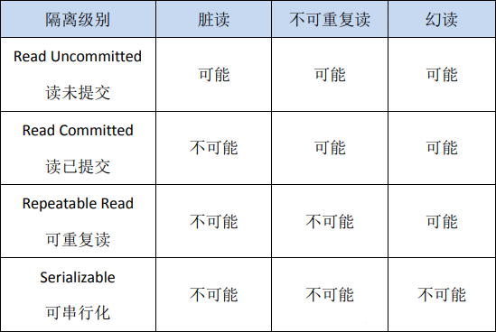
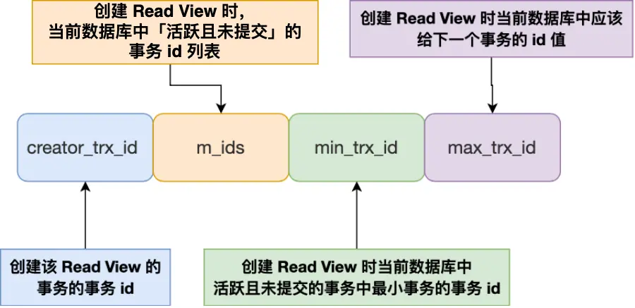

## 数据库

### 一、数据库特性

#### 1.1 原子性(Atomicity)
- 事务中的语句要么全部执行，要么全部不执行。
#### 1.2 一致性(Consistency)
- 事务追求的最终目标，是指事务操作前和操作后，数据满足完整性约束，数据库保持一致性状态。一致性的实现既需要数据库层面的保障，也需要应用层面的保障。
#### 1.3 隔离性(Isolation)
- 数据库允许多个并发事务同时对其数据进行读写和修改的能力，隔离性保证事务执行尽可能不受其他事务影响。
#### 持久性(Durability)
- 保证事务提交后不会因为宕机等原因导致数据丢失。
### 二、并发事务中可能存在的问题
#### 2.1 脏读

&nbsp; &nbsp; &nbsp;当前事务中读取到其他事务未提交的数据，这种情况就是脏读。


```SQL
-- 事务A
set autocommit = 0;
SET SESSION TRANSACTION ISOLATION LEVEL READ UNCOMMITTED;
START TRANSACTION;
SELECT `name` FROM person WHERE age = 24;

--事务B
set autocommit = 0;
SET SESSION TRANSACTION ISOLATION LEVEL READ UNCOMMITTED; --设置为读未提交的隔离级别
START TRANSACTION;
UPDATE person SET `name` = 'HZ' WHERE age = 24;
```
#### 2.2 不可重复读

&nbsp; &nbsp; &nbsp;在一个事务中，先后两次读取同一个数据，两次读取的结果不一样，这种现象称为不可重复读，该事务读取到了其他事务已经提交的数据。脏读与不可重复读的区别在于：前者读到的是其他事务未提交的数据，后者读到的是其他事务已提交的数据。


#### 2.3 幻读

&nbsp;&nbsp;&nbsp;在事务A中按照某个条件先后两次查询数据库，两次查询结果的条数不同，这种现象称为幻读。不可重复读与幻读的区别可以通俗的理解为：前者是数据变了，后者是数据的行数变了。


### 三、数据库的隔离级别

- **读未提交**
&nbsp;&nbsp;&nbsp;指的是一个事务还没有提交时，他做的变更就能被其他事务看到。
- **读已提交**
&nbsp;&nbsp;&nbsp;指一个事务提交之后，它做的变更才能被其他事务看到。
- **可重复读**
&nbsp;&nbsp;&nbsp;指一个事务执行过程中看到的数据，一直跟这个事务启动时看到的数据是一致的，这也是MySQL InnoDB的默认隔离级别。
- **串行化**
&nbsp;&nbsp;&nbsp;会对记录加上读写锁，在多个事务对这条记录进行读写操作时，如果发生了读写冲突的时候，后访问的事务必须等前一个事务执行完成，才能继续执行。
#### 3.1 Read View
&nbsp;&nbsp;&nbsp;Read View是一个数据库的内部快照，保存着数据库某个时刻的数据信息。Read View会根据事务的隔离级别决定在某个事务开始时，该事务能看到什么信息。通过Read View，事务可以知道此时此刻能看到哪个版本的数据记录（有可能不是最新版本的，也有可能是最新版本的）。读已提交隔离级别是在每个语句执行前重新生成一个Read View，而可重复读隔离级别是启动事务时生成一个Read View，然后整个事务期间都在用这个Read View。
**Read View中四个重要字段**

&nbsp;&nbsp;&nbsp;上述图中的四个字段的值是不会更新的，比如说m_ids中记录了创建Read View时，当前数据库中活跃且未提交的事务id列表。如果说m_ids中记录的事务id对应的事务提交了，也不会被从这个m_ids中删除掉。
&nbsp;&nbsp;&nbsp;**max_trx_id 并不是m_ids中的最大值，事务id是递增分配的。比如，现在有id为1，2，3这三个事务，之后id为3的事务提交了。那么一个新的读事务在生成ReadView时，m_ids就包括还活跃的事务1和2，min_trx_id的值就活跃事务 中事务 id 最小的事务，即1，max_trx_id的值就是4。**
**创建Read View时，可以将记录中的trx_id划分为这三种情况。**

&nbsp;&nbsp;&nbsp;我们的数据库中，每一条数据记录至少有两个隐藏列，一个是`DB_TRX_ID`，一个是`DB_ROLL_PTR`，`DB_TRX_ID`是存储了修改当前记录的事务id。
&nbsp;&nbsp;&nbsp;**Read View的规则**

&nbsp;&nbsp;&nbsp;解释一下第三条，如果当前记录的`trx_id`在我们当前事务创建的`Read View`的`min_trx_id`和`max_trx_id`，表示是当前事务之前创建的其他事务。如果`trx_id`在m_ids列表中，表明改动当前记录的事务还没有提交，按照隔离级别，该版本的记录对当前事务不可见。
&nbsp;&nbsp;&nbsp;如果说当前记录的`trx_id`不在`m_ids`中，表明在创建当前事务的时候，改动当前记录的事务已经提交了。

#### 3.2 可重复读的执行流程
#### 3.3 读提交的执行流程
### 四、数据库锁

#### 4.1 行锁，锁定数据行
- 共享锁，允许获得该锁的事务读取数据行，并且允许其他事务获得该数据行上的共享锁，但阻止其他事务获取该数据行上的排他锁。
- 排他锁，允许获得该锁的事务更新或删除数据行，但阻止其他事务获得该数据行上的共享锁和排他锁。

```SQL
SET autocommit = 0;
START TRANSACTION; -- 开启事务A
SELECT * FROM person WHERE age = 23 FOR SHARE;  -- 事务A获取共享锁

SET autocommit = 0;
START TRANSACTION; -- 开启事务B
SELECT * FROM person WHERE age = 18 FOR SHARE;  -- 事务B可以获取到共享锁

SET autocommit = 0;
START TRANSACTION; -- 开启事务C
SELECT * FROM person WHERE age = 21 FOR UPDATE; -- 事务C获取排他锁，由于事务A获取共享锁并且没有提交，导致事务C一直阻塞无法获取排他锁，最终导致报错：1205 - Lock wait timeout exceeded; try restarting transaction
```
#### 4.2 表锁，锁定整个表
#### 4.3 意向锁，是一种表级锁
&nbsp;&nbsp;&nbsp;数据库支持表锁和行锁，并发事务中可能存在以下问题，比如说事务A对数据行加了行级共享锁，事务B想要对表加表级排他锁，那么他就需要对每一个数据行进行遍历，判断是否有数据行加了行级共享锁，效率就很低。
&nbsp;&nbsp;&nbsp;意向锁也分为两种，一种是意向共享锁(IS)，一种是意向排他锁(IX)，由InnoDB引擎自动添加，不需要用户干预。
- 意向共享锁(IS)，如果事务要对数据行加行级共享锁，那么他必须先获取该表的IS锁。
- 意向排他锁(IX)，如果事务要对数据行加行级排他锁，那么他必须先获取该表的IX锁。
#### 4.4 行锁的实现
##### 4.4.1 记录锁
&nbsp;&nbsp;&nbsp;只阻止其他事务修改或删除被锁定的行，不阻止插入不在锁范围的行。
&nbsp;&nbsp;&nbsp;精确匹配索引行才会加记录锁，比如查询主键这种。如果没有命中索引行，那么就会扫描全表，给每一行加S锁或者X锁。

```SQL
SELECT * FROM person WHERE id = 18 FOR UPDATE; -- id是主键
```
##### 4.4.2 间隙锁
&nbsp;&nbsp;&nbsp;阻止其他事务在间隙里插入新行，不阻止修改已经存在的记录。
&nbsp;&nbsp;&nbsp;锁住索引行之间的空隙。主要是针对范围查询和获取排他锁的情况。但是不锁定已有行，单独使用间隙锁不能防止幻读。
```SQL
SELECT * FROM person WHERE id BETWEEN 17 AND 28 FOR UPDATE;
```
##### 4.4.3 next-key锁
&nbsp;&nbsp;&nbsp;记录锁加间隙锁
&nbsp;&nbsp;&nbsp;防止其他事务修改已有记录，防止其他事务在锁定范围内插入新记录。

### 五、唯一约束UNIQUE
&nbsp;&nbsp;&nbsp;使用唯一约束保证数据的唯一性，使用UNIQUE约束会创建一个唯一索引，提升查找速度。
&nbsp;&nbsp;&nbsp;组合约束保证多列组合值唯一。UNIQUE(column1, column2, column3);

### 六、外键 FOREIGN KEY

&nbsp;&nbsp;&nbsp;外键维护表之间的关联关系和数据完整性，约束保证子表的列值必须在父表（被引用表）中存在，防止出现孤立数据，比如说子表中的数据在父表中不存在。
```SQL
CREATE TABLE department (
    dept_id INT PRIMARY KEY,
    dept_name VARCHAR(50)
);

CREATE TABLE employee (
    emp_id INT PRIMARY KEY,
    emp_name VARCHAR(50),
    dept_id INT,
    FOREIGN KEY (dept_id) REFERENCES department(dept_id)
    ON DELETE CASCADE
    ON UPDATE CASCADE
);

INSERT INTO department VALUES(1, '人事部');
INSERT INTO department VALUES(2, '行政部');
INSERT INTO department VALUES(3, '后勤部');
INSERT INTO department VALUES(4, '开发部');

INSERT INTO employee VALUES(1, 'HZ', 1);
INSERT INTO employee VALUES(2, 'WAD', 2);
INSERT INTO employee VALUES(3, 'SMH', 2);

DELETE FROM department WHERE dept_name = '行政部'; -- 同时也删除employee中的WAD和SMH这两条数据
```
### 七、并发
#### 7.1 悲观并发
&nbsp;&nbsp;&nbsp;默认会发生数据冲突，在访问数据前先加锁。这样的话，其他事务访问同一数据时会被阻塞。

```SQL
START TRANSACTION;
SELECT * FROM account WHERE id = 1 FOR UPDATE; -- 加 X 锁，加记录锁
UPDATE account SET balance = balance - 100 WHERE id = 1;
COMMIT;
```
#### 7.2 乐观并发
&nbsp;&nbsp;&nbsp;默认不会发生冲突，在修改数据时进行检查，比如使用时间戳或者是版本号进行检查。如果修改数据时判断时间戳改变或者版本号改变，则重试。


