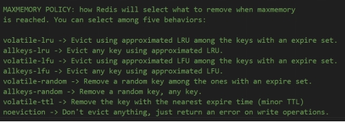

## 缓存

### 一、本地缓存

- 应用程序本地内存中的缓存，我们定义一些数据结构，比如单例的对象，将数据存储到这个单例的对象中。
- 本地缓存不支持应用程序之间共享缓存数据，每一个应用程序都需要维护自己的缓存数据。
- 本地缓存的容量通常受限于应用程序的内存大小，如果数据量较大，容易导致内存溢出，造成程序崩溃。
- 本地缓存不支持持久化功能，缓存只在应用程序运行时存在，应用程序结束运行，缓存也会丢失。

### 二、Redis

#### 2.1 Redis缓存

- Redis缓存通常存储在一个独立的Redis服务器上，应用程序通过网络请求来存取缓存数据。
- Redis缓存支持应用程序之间共享缓存数据，多个应用程序可以访问同一个Redis缓存。
- Redis本身存储在外部服务器上，可以通过配置来扩展缓存容量，理论上可以存储更多数据。对于大规模的缓存需求，Redis 更加合适。
- Redis缓存支持持久化功能，可以将内存中的数据持久化到磁盘。

#### 2.2 Redis主数据库和过期字典

- Redis的主数据库存储键和对应的值。
- Redis的过期字典存储键和对应的过期时间，我们为一个键设置过期时间后，Redis会将该键及其过期时间存放到一个过期字典中，这个过期字典也是一个键值对的数据结构。

#### 2.3 Redis删除策略

Redis中的键过期后，如果没有触发Redis的删除策略的话，过期的键还依然存储在内存中，过期字典和主数据库也不会删除对应的键值。

##### 2.3.1 惰性删除

- 访问已经过期的键，会检查他是否已经过期，如果过期，Redis会惰性的删除该键，从主数据库和过期字典中删除。

##### 2.3.2 定期删除

- Redis后台任务，定期的随机抽取过期字典中设置了过期时间的键，比如每秒扫描10次，每次扫描5个，如果这些键过期了，就将其在内存中删除。
- 这个扫描的次数和conf文件相关，其中的hz 10，就是每秒扫描10次。maxmemory-samples 5这个表示每次扫描的键的数量。
- 为什么不扫描全部键而是部分键，是因为扫描全部键的话，CPU的负载很高，浪费大量时间在检测上面。可能还会导致Redis挂掉。

#### 2.4 Redis的内存淘汰机制

- 定期删除+惰性删除并不能保证所有的过期的键都会被删除，如果定期删除遗漏了大量的键没有被删除，我们在很长的时间内也没有访问这些键，那么这些键会持续的占用内存，可能导致Redis内存耗尽。
- conf文件中配置了Redis可用的最大的内存，当内存到达使用限制时，会执行内存淘汰策略。
- 下述几种内存淘汰策略
   

- LRU算法，最近最少使用。这个策略是看多久没有碰，最后一次被使用到发生替换的时间的长短，时间越长就会被淘汰

- LFU算法，最不经常使用。这个是看历史上总共被访问的次数

#### 2.5 Redis缓存穿透

##### 2.5.1 缓存穿透定义

- 缓存穿透是指恶意用户或程序请求查询的数据在缓存和数据库中都不存在，导致每次请求都会直接打到数据库，绕过缓存。由于缓存没有存储该请求的结果，所有这类请求都会绕过缓存，直接访问数据库，从而导致数据库承受巨大的压力。

##### 2.5.2 缓存穿透原因

 - 有意构造大量不存在的数据请求，如查询不存在的用户 ID 或商品 ID，缓存中没有这些数据，因此直接请求数据库。
 - 一些业务逻辑上无法避免查询不存在的数据，例如用户查询某些过时或错误的请求参数，数据库中也没有相应的记录。

##### 2.5.3 缓存穿透危害

- 由于查询的数据既不在缓存中，也不在数据库中，因此每次请求都会直接打到数据库，造成数据库压力增大，甚至引发性能瓶颈。

##### 2.5.4 缓存穿透解决方法

- 缓存空值，当缓存中没有数据时，我们不直接查询数据库，而是将一个特殊的值存储到缓存中，这样下次相同的请求就不会访问数据库，直接返回这个特殊值。
- 对请求进行统一校验，如果数据无效，直接返回错误信息或者特殊值。

#### 2.6 Redis缓存击穿

##### 2.6.1 缓存击穿原因

- 缓存中存储的某个热点数据失效，大量的并发请求访问这个热点数据发现缓存失效，直接去访问数据库，导致数据库的压力骤增。

##### 2.6.2 缓存击穿危害

- 热点数据失效，大量的请求直接访问数据库，增加数据库的压力，可能导致数据库连接数耗尽。

##### 2.6.3 缓存击穿解决方法

- 设置热点数据永不过期，通过后台任务更新缓存数据、

- 采用互斥锁的方式，通过加锁机制，保证同一时刻只能有一个线程访问数据库。其他线程只能等待该线程访问数据库并将数据写入缓存中再访问数据库。

#### 2.7 Redis缓存雪崩

##### 2.7.1 缓存雪崩定义

- 某一时刻，大量缓存同时失效，导致大量请求直接访问数据库层，造成数据库压力骤增，甚至可能导致数据库崩溃，系统不可用。

##### 2.7.2 缓存雪崩原因

- 缓存数据的TTL设置好的，如果大量缓存设置了相同或者相近的过期时间，在这些缓存集中失效时，会造成大量请求无法从缓存中获取数据，只能访问数据库。

- Redis服务器出现宕机或故障导致缓存失效，大量请求直接访问数据库。

##### 2.7.3 缓存雪崩解决方法

- 给不同的键的TTL增加随机值，防止不同的键在相近的时间内过期。
- 设置热点数据永不过期，后台异步的更新缓存。
- 采用多级缓存的结构，本地缓存+Redis缓存，Redis缓存失效，首先尝试从本地缓存获取数据，避免直接访问数据库。
