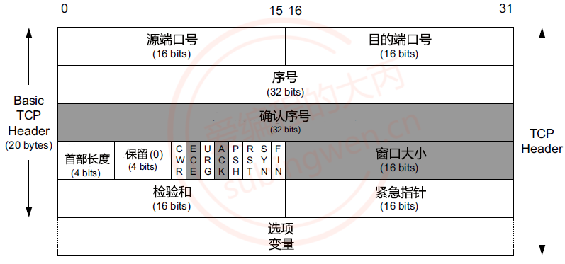
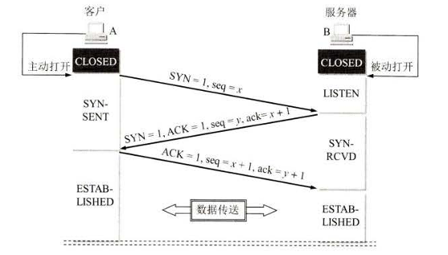
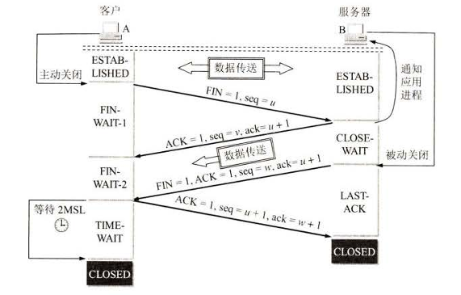

### 一、TCP三次握手和四次挥手

#### 1.1 TCP协议

- TCP（Transmission Control Protocol，传输控制协议）是互联网协议套件中的核心协议之一，位于传输层。它提供了一种可靠的、面向连接的、基于字节流的数据传输服务。TCP 的主要特点是确保数据在传输过程中不丢失、不重复，并且按顺序到达。

##### 1.1.1 TCP协议的特点

- **面向连接**。TCP是面向连接的，通信的双方在通信之前必须先建立连接。传输完成后需要关闭连接。
- **可靠性**。TCP通过确认机制和重传机制，确保数据不丢失，不重复。同时通过检验和，校验检查数据的完整性。
- **有序性**。TCP保证发送端先发送的数据，接收端一定先收到。
- **流量控制**。通过滑动窗口机制，动态调整发送速率。
- **拥塞控制**。通过慢启动、拥塞避免等算法，避免网络拥塞。

##### 1.1.2 TCP报文段的格式

- 源端口：表示发送端的端口，用来识别发送的进程。

- 目的端口：表示接收端端口号，表示发送给哪一个进程。

- 序号：表示本报文段携带的第一个字节的序号

  - 由于TCP是面向字节流的，在一个TCP连接中传送的字节流中的每一个字节都按顺序编号

  - 首部中的序号字段则是指本报文段所发送的数据的第一个字节的序号，这是随机生成的。

  - 序号是循环使用的，当序号增加到最大值时，下一个序号就又回到了0。

- 确认序号：表示期望收到的下一个报文段的第一个数据字节的序号，如果确认序号为N，序号为S，则表明到序号N-S为止的所有数据字节都已经被正确地接收到了，期望下一个报文段的序号为N。

#### 1.2 TCP三次握手

##### 1.2.1 三次握手的过程

- 客户端 A 在打算建立 TCP 连接时，向服务器 B 发送连接请求报文段，这时首部中的同步位`SYN = 1`，同时选择一个初始序号`seq = x`。 TCP 规定，SYN 报文段（即`SYN = 1`的报文段）不能携带数据，但要消耗掉一个序号。这时，TCP 客户进程进入`SYN-SENT`（间步已发送）状态。 
- B 收到连接请求报文段后，如果同意建立连接，则向 A 发送确认。在确认报文段中应把 SYN 位和 ACK 位都置1，确认号是`ack = x + 1`，同时也为自己选择一个初始序号`seq = y`。 请注意，这个报文段也不能携带数据，但同样要消耗掉一个序号。这时 TCP 服务器进程进 入`SYN-RCVD`（同步收到）状态。
- TCP 客户进程收到 B 的确认后，还要向 B 给出确认。确认报文段的 ACK 置 1，确认号`ack = y + 1`，而自己的序号`seq=x + 1`。TCP 标准规定，ACK 报文段可以携带数据。但如果不携带数据则不消耗序号，在这种悄况下，下一个数据报文段的序号仍是`seq = x + 1`。这 时，TCP 连接已经建立，A 进入`ESTABLISHED`（已建立连接）状态。 当 B 收到 A 的确认后，也进入`ESTABLISHED`状态。

##### 1.2.2 为什么需要三次握手

- 像上述的连接过程，A 收到 B 的连接确认的报文段后，还要向 B 发送一个确认报文，表示自己收到了 B 的确认报文，同时向 B 表示自己接受连接。这主要是为了防止已失效的连接请求报文段突然又传送到了 B，因而产生错误。
- 现假定出现一种异常情况，即 A 发出的第一个连接请求报文段并没有丢失，而是在某些网络节点长时间滞留了，以致延误到连接释放以后的某个时间才到达 B。本来这是一个早已失效的报文段。但 B 收到此失效的连接请求报文段后，就误认为是 A 又发出一次新的连接请求。于是就向 A 发出确认报文段，同意建立连接。假定不采用报文握手，那么只要 B 发出确认，新的连接就建立了。 由于现在 A 并没有发出建立连接的诸求，因此不会理睬 B 的确认，也不会向 B 发送数据。但 B 却以为新的运输连接已经建立了，并一直等待 A 发来数据。B 的许多资源就这样白白浪费了。

#### 1.3 TCP四次挥手

##### 1.3.1 四次挥手的过程

- 数据传输结束后，通信的双方都可释放连接。现在 A 和 B都处于`ESTABLISHED`状态。A 的应用进程先向其 TCP 服务发出连接释放报文段，并停止再发送数据，主动关闭 TCP 连接。A把连接释放报文段首部的终止控制位`FIN`置1，具序号`seq = u`，它等前面已传送过的数据的最后一个字节的序号加1。 这时 A 进入`FIN-WAIT-1` （终止等待1) 状态，等待 B 的确认。
- B 收到连接释放报文段后即发出确认，确认号是 `ack = u + 1`，而这个报文段自己的序号是 v，等于B 前面已传送过的数据的最后一个字节的序号加1。然后 B 就进入`CLOSE WAIT`（关闭等待）状态。 
- A 收到来自 B 的确认后，就进入`FIN-WAIT-2 `（终止等待2) 状态，等待 B 发出的连接释放报文段。
- 若 B 已经没有要向 A 发送的数据，其应用进程就通知 TCP 释放连接。这时 B 发出的连接释放报文段必须使`FIN= 1`。现假定 B 的序号为w（在半关闭状态B可能又发送了一些数据）。 B 还必须重复上次已发送过的确认号`ack = u + 1`。这时 B就进入`LAST-ACK`（最后确 认）状态，等待 A 的确认。
- A 在收到 B 的连接释放报文段后，必须对此发出确认。在确认报文段中把 ACK 置1, 确认号`ack = w + 1`, 而自己的序号是`seq= u + 1`（根据 TCP 标准，前面发送过的`FIN`报文段要消耗一个片号）。然后进入到`TIME-WAIT`（时间等待）状态。。注意，现在 TCP 连接还没有释放掉。必须经过时间等待计时器(TIME-WAIT timer)设置的时间`2MSL`后， A 才进入到`CLOSED`状态。

##### 1.3.2 MSL 最长报文段寿命

就上述的四次挥手而言，为什么 A在TIME-WAIT状态必须等待2MSL 的时间呢？这有两个理由。

- **第一，为了保证 A 发送的最后一个 ACK 报文段能够到达 B**。这个 ACK 报文段有可能丢失，因而使处在`LAST-ACK`状态的 B 收不到对已发送的`FIN+ ACK`报文段的确认。 B 会超时重传这个`FIN+ACK`报文段，而 A 就能在 2MSL 时间内收到这个重传的 FIN+ ACK 报 文段。接着 A 重传一次确认，重新启动 2MSL 计时器。最后， A 和 B 都正常进入到`CLOSED`状态。如果 A 在`TIME-WAIT`状态个等待一段时间，而是在发送完 ACK 报文段后立即释放连接，那么就无法收到B重传的 FIN+ ACK 报文段，因而也不会再发送一次确认报文段。这样， B 就尤法按照正常步骤进入`CLOSED`状态。
- **第二，防止上一节提到的”已失效的连接请求报文段”出现在本连接中**。 A 在发送完最后一个 ACK 报文段后，再经过时间 2MSL，就可以使本连接持续的时间内所产生的所有报文段都从网络中消失。这样可以使下个新的连接中不会出现这种旧的连接请求报文段。

### 二、TCP粘包/半包处理

#### 2.1 TCP粘包是什么

- TCP 粘包指的是多个应用层数据包在接收方被合并到一个 TCP 缓冲区中，无法直接区分边界的现象。

#### 2.2 TCP粘包的原因

- 发送端缓冲区存在上次没有发送完的数据，导致多次发送的数据被合并，接收端无法识别边界。
- 发送端发送数据频率较高，接收端接收数据不及时，造成数据在接收端缓冲区堆放。
- Nagle算法限制，TCP 底层的安全和效率机制不允许字节数特别少的小包发送频率过高，TCP会在底层累计数据长度到一定大小才一起发送，比如连续发送1字节的数据要累计到多个字节才发送。

#### 2.3 如何处理粘包问题

- 处理粘包问题采用TLV方式处理，其中T指的是Tag，相当于是消息的id。L是Length，就是消息的长度，这一个字段存储了要读取的消息内容的长度。V是Value表示真正要读取的数据。

- 采用TLV方式处理粘包问题，发送端和接收端约定发送的消息的格式。发送消息比如`消息Tag + 消息长度Length + 消息内容Value`这样的结构。双方约定`消息Tag`和`消息长度Length`都为2个字节，`消息内容Value`长度不固定。

- 接收端读取时，不断从缓冲区读取数据，开始读取时，读取前两个字节放入消息节点的id字段中。之后再读取两个字节放入消息节点的length字段中。

- 根据该length的值，我们再处理不断的接收到的字节，可能接收到不足或者是大于length个字节的数据，如果不足length个字节就继续接受。如果大于length个字节，就取出前length个字节去构造消息节点，取出length之后的剩余的字节就是其他消息的字节。

- 通过上述方式，实现了对消息的切包处理，因为上述处理方式定义了消息边界。

